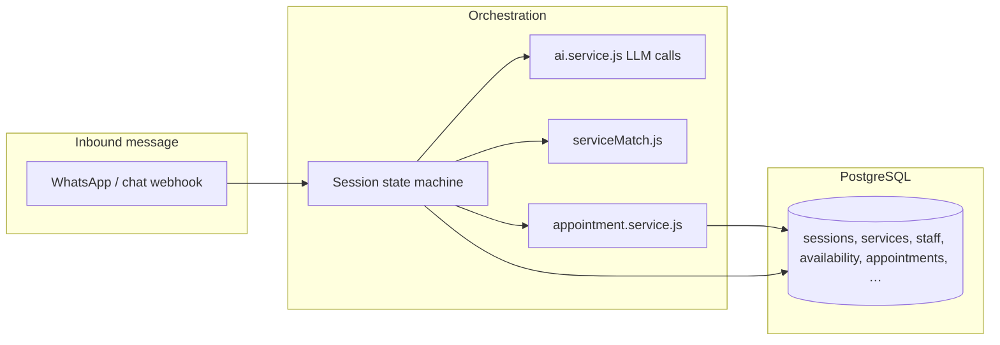

# Appointbot Assistant — Capabilities Report  
### AI layer + database-backed booking engine

**Document purpose:** Describe what the product assistant can do today, how **large language model (LLM)** calls and **deterministic** code interact, and which **PostgreSQL** entities make that behavior possible.  
**Audience:** Product, support, and engineering.  
**Primary code references:** `src/services/ai.service.js`, `src/services/appointment.service.js`, `src/routes/webhook.js`, `src/utils/serviceMatch.js`, `db/schema.sql`.

---

## 1. Executive summary

The assistant is a **WhatsApp-first (and chat-proxy) booking receptionist** for multi-tenant businesses (salons, clinics, tutors, etc.). It combines:

| Layer | Role |
|--------|------|
| **LLM (Groq or local Ollama)** | Classifies intent, extracts dates/times/services from natural language, answers FAQs, generates help/nudges/fallbacks, and confirms yes/no when regex is insufficient. |
| **Deterministic logic** | Conversation state machine, fuzzy multi-service matching, slot arithmetic, DB constraints, idempotent writes. |
| **PostgreSQL** | Businesses, staff, services, weekly availability, appointments, sessions, customers, leads, and related operational tables. |

A single **appointment row** still has one `service_id` foreign key; **multiple services in one message** are represented by **summed duration and price**, a **combined display name**, and a **notes** field describing the combined booking.

---

## 2. Architecture (conceptual)

- **Session state** (`sessions.temp_data` JSONB) holds booking-in-progress fields (chosen services, date, time, staff, pending confirmation payload, etc.).
- **Active flows** time out after ~10 minutes of inactivity; **idle** sessions after ~30 minutes (see `session.service.js`).

---

## 3. AI layer (`src/services/ai.service.js`)

### 3.1 Model provider

- **Primary:** Groq OpenAI-compatible Chat Completions API (`GROQ_API_KEY`, optional `GROQ_MODEL`, default `llama-3.3-70b-versatile`).
- **Fallback:** Local **Ollama** (`OLLAMA_URL`, `OLLAMA_MODEL`).
- Temperature is typically **0** for extraction/classification; slightly higher for conversational glue (help, nudges).

### 3.2 LLM-powered capabilities

| Capability | Function | What it does |
|------------|----------|----------------|
| **Intent + handoff** | `classifyMessage` | Returns `{ handoff, intent }`. Intents include: `book`, `cancel`, `reschedule`, `repeat_booking`, `reminder`, `my_appointments`, `availability`, `help`, `contact`, `faq`, `none`. **Regex fast-path** can mark handoff without calling the LLM. |
| **Booking extraction** | `extractBookingIntent` | From free text, returns JSON: `service`, `date` (YYYY-MM-DD), `time` (HH:MM), `staffName`. Uses **business timezone** and an **upcoming-week date list** in the prompt so weekday names resolve to future dates. Handles English, **Hindi/Hinglish** cues (e.g. “kal”, “baje”), fuzzy times (“morning” → 10:00, etc.). |
| **Reschedule extraction** | `extractRescheduleIntent` | New `date` / `time` for moving an appointment. |
| **Availability questions** | `extractAvailabilityQuery` | Resolves a **day** vs **week** style question to dates for slot scanning. |
| **Confirmation** | `extractConfirmation` | Maps user reply to `yes` / `no` / `unknown`. **Heavy regex first** (including Hindi short forms); LLM only if needed. |
| **Handoff (legacy/aux)** | `detectHandoffIntent` | Optional deeper check for “talk to a human.” |
| **FAQ / small talk** | `answerConversational` | Short answer using optional business context (name, type, services). |
| **Help text** | `generateHelpReply` | Natural-language help; not a rigid bullet menu. |
| **Returning user greeting** | `generateReturningUserGreeting` | Personalized hello when name is known. |
| **Inactivity nudge** | `generateInactivityNudge` | Gentle follow-up if the user stalls mid-flow. |
| **Error fallback** | `generateDynamicFallbackReply` | When something fails server-side, apologizes and steers to HELP. |
| **Legacy intent** | `extractGlobalIntent` | Older single-intent classifier; kept for compatibility. |

### 3.3 System style constraints

WhatsApp-oriented replies use a **receptionist system prompt**: short (often 2–3 lines), low filler, limited emojis — see `WHATSAPP_RECEPTIONIST_SYSTEM_PROMPT` in `ai.service.js`.

---

## 4. Deterministic logic (not “the model guessing the DB”)

These behaviors are **code-defined** and crucial for reliability:

| Area | Behavior |
|------|-----------|
| **Service selection** | `matchServicesFromMessage` / `matchServiceFromMessage` (`serviceMatch.js`): numbered list, **fuzzy** name match (typos, substring), **multiple services** in one reply (comma / `and` / `&` / `;`, or digit-only lists), deduplication by `service_id`. Strips leading “please book”. |
| **Aggregation** | `aggregateMatchedServices`: **sums** `duration_minutes` and **price**; builds combined `serviceName` string; sets `notes` for multi-service rows. |
| **Staff selection** | `matchServiceFromMessage` reused on staff names + **`any`** keyword + numeric index. |
| **Slots** | `getAvailableSlots`: weekly `availability` minus existing appointment blocks; configurable duration; typically **30-minute grid** subject to fitting **total** duration. |
| **Booking commit** | `bookAppointment`: idempotency check, race-safe slot re-check, insert **one** appointment. |
| **Audio** | Voice notes: download + **Whisper** transcription (`whisper.service.js`), then same text pipeline. |

---

## 5. Database layer (what the assistant “knows” structurally)

Core tables **directly underpin** automated booking:

| Table / entity | Purpose for the assistant |
|----------------|----------------------------|
| **businesses** | Tenant: name, `type` (salon/doctor/dentist/tutor/other), **timezone** (all date logic), phone/slug, WhatsApp Cloud API fields, reminder template name, confirmation cutoff settings. |
| **staff** | People resources; booking attaches to `staff_id`. |
| **services** | Catalog: name, `duration_minutes`, `price`, `active`. Drives lists and duration for slots. |
| **availability** | Recurring weekly windows per staff (`day_of_week`, `start_time`, `end_time`). **No arbitrary one-off holidays in this table** — “closed Sunday” is a **data** outcome of empty availability, not a separate flag in the chat layer. |
| **appointments** | Confirmed/cancelled/completed/no_show; `scheduled_at`, `duration_minutes`, optional `service_id`, `notes`, confirmation lifecycle columns, reminders flags. |
| **customers** | `(phone, business_id)` keyed name storage for returning users and prompts. |
| **sessions** | `state` + `temp_data` for the FSM. |
| **appointment_events** | Audit stream for lifecycle/debugging. |

**Supporting / operational** (not exhaustive): `subscriptions` (plans/billing), `leads` / `lead_events` (funnel), `campaigns` (marketing WhatsApp), `messaging_preferences` (opt-outs), `async_job_executions`, `customer_notes`, etc.

---

## 6. Booking flows the assistant supports (conversation)

States are implemented in `webhook.js` + `session.service.js`. Typical paths include:

- **New booking:** service selection → (optional staff) → date → time → name (if needed) → **YES/NO** confirmation → DB insert.
- **Cancel:** pick which upcoming appointment → confirm.
- **Reschedule:** pick appointment → new date/time → confirm.
- **List bookings:** reads upcoming appointments for the phone.
- **Availability questions:** can summarize free windows using DB-derived slots (with LLM helping scope the question to dates).
- **Help / contact / FAQ:** templated or LLM-assisted replies using business context where available.
- **Human handoff:** transitions to a dedicated state / messaging pattern when the user insists on a human.

Exact keyword shortcuts (e.g. HELP) and idle “book from one message” behavior are implemented in the webhook and may call `extractBookingIntent` when the user bundles service + date + time.

---

## 7. Integrations

| Integration | Role |
|-------------|------|
| **WhatsApp Cloud API** | Inbound webhook, outbound text/templates; per-business tokens possible. |
| **Groq / Ollama** | LLM inference. |
| **Groq Whisper** | Audio transcription for voice messages. |
| **Razorpay** | Subscription/billing for the **business app**, not per-customer haircut payment in the default chat flow. |

---

## 8. Limitations and honest boundaries

1. **One appointment row per booking** — Multiple services are merged into **total duration**, **combined label**, and **`notes`**; there is **no** `appointment_services` junction table in the core schema.
2. **Availability model** — Recurring weekly rules; **exceptions** (public holidays, one-off closures) require either adjusted **availability** data or accepting that the bot will treat the week as “normal.”
3. **LLM mistakes** — Misclassification or wrong date extraction can occur; critical actions still pass through **confirmation** and **DB slot validation**.
4. **“Remind me at 7pm”** vs **reschedule** — Intents are designed to differ; edge phrasing can still confuse users or the model.
5. **Multi-service parsing** — Splitting on **and** can theoretically break if a **single** service name contains “ and ”; commas or numbers are safer for those catalog names.

---

## 9. Configuration surface (high level)

Operators and developers should be aware of:

- **Environment:** `GROQ_API_KEY`, `GROQ_MODEL`, `OLLAMA_*`, `DEFAULT_BUSINESS_ID`, WhatsApp tokens/templates, `JWT_SECRET`, `DATABASE_URL`, etc.
- **Per business (DB):** timezone, services, staff, availability, WhatsApp phone number id / templates, confirmation windows, reminder toggles.

---

## 10. Related documents

- `BACKEND_SYSTEM_OVERVIEW.md` — Architecture and module map.
- `IMPLEMENTATION_ROADMAP.md` — Phased plan (stability, calendar, conversation repair, handoff, etc.).
- `API.md` — API surface (if present and maintained).
- `WHATSAPP_TESTING.md` — Channel testing notes.

---

*Generated to reflect the codebase structure; behavior should be validated against staging data and real WhatsApp templates before customer-facing promises.*
