# appointbot-be Backend System Overview

This document describes the backend architecture and the main runtime flows so new contributors can quickly understand how `appointbot` works.

Primary reference: `src/server.js`, routes under `src/routes/`, core business logic under `src/services/`, and DB schema in `db/schema.sql`.

Related docs:
- API reference: `docs/API.md`
- WhatsApp testing notes: `docs/WHATSAPP_TESTING.md`
- UI notes: `docs/UI_ANALYSIS.md`
- Assistant capabilities + stability roadmap: `docs/ASSISTANT_CAPABILITIES_REPORT.md`, `docs/IMPLEMENTATION_ROADMAP.md`

## 1) High-level architecture

`appointbot-be` is a Node.js + Express server with:
- REST endpoints for auth, dashboard helpers, and onboarding/billing configuration
- A WhatsApp webhook handler that drives the AI booking conversation
- A background reminder scheduler (cron) that sends reminders to customers
- PostgreSQL persistence (multi-tenant per `business_id`)

Tenancy model:
- Each request is associated with a `businessId` either from auth (`requireAuth`) or from WhatsApp routing (`getBusinessByPhone` + `DEFAULT_BUSINESS_ID` fallback).

Main modules:
- `src/server.js`: Express bootstrap + global error handling + cron start
- `src/routes/*`: HTTP endpoints
- `src/services/*`: DB queries + business logic (appointments, sessions, AI, WhatsApp, reminders, billing)
- `src/middleware/*`: JWT auth and plan limit enforcement
- `src/utils/formatter.js`: formatting helpers for chat UI / WhatsApp messages

## 2) Express entrypoint and routing

Server bootstrap (`src/server.js`):
- Configures Express JSON body parsing
- Enables CORS from `FRONTEND_URL`
- Mounts routers:
  - `/api/auth` -> `src/routes/auth.js`
  - `/api/business` -> `src/routes/business.js`
  - `/api/billing` -> `src/routes/billing.js`
  - `/api/whatsapp-connect` -> `src/routes/whatsappConnect.js`
  - `/webhooks/razorpay` and `/webhook/razorpay` -> `src/routes/razorpayWebhook.js`
  - `/webhook` -> `src/routes/webhook.js` (WhatsApp + chat proxy)
  - `/chat` -> `src/routes/chat.js` (test UI + proxy)
  - `/admin` -> `src/routes/admin.js` (admin-only HTML page; currently unprotected)
- Starts reminder cron via `startReminderScheduler()` on server listen

## 3) Runtime flows (request lifecycle)

### 3.1 Health endpoint
- `GET /health` returns `{ status: "ok", service: "appointbot" }`

### 3.2 Auth flow (JWT)
Routes (`src/routes/auth.js`):
- `POST /api/auth/signup`
  - Inserts into `business_owners`
  - Returns JWT with `{ ownerId, businessId: null, email }`
- `POST /api/auth/login`
  - Verifies bcrypt hash
  - Loads the owner row + `businesses.slug`
  - Returns JWT with `{ ownerId, businessId, email }`
- `GET /api/auth/me`
  - Protected by `requireAuth` (JWT)
  - Loads owner + business info

Auth middleware (`src/middleware/auth.js`):
- `requireAuth(req,res,next)`
  - Reads `Authorization: Bearer <token>`
  - Verifies JWT using `JWT_SECRET`
  - Sets `req.owner = payload` (expected shape: `{ ownerId, businessId, email }`)

### 3.3 Business onboarding and configuration
Routes (`src/routes/business.js`):
- `POST /api/business/onboard` (onboarding step 1)
  - Creates `businesses` row (slug derived from `name`)
  - Creates an initial 14-day trial subscription in `subscriptions`
  - Links `business_owners.business_id` and sets `onboarded = TRUE`
  - Returns `{ business, token }` where token includes `businessId`
- `GET /api/business` / `PUT /api/business` to view/update business metadata
- Staff and services management:
  - `/api/business/services` CRUD (protected, plus plan limit middleware on create)
  - `/api/business/staff` CRUD (protected, plus plan limit middleware on create)
  - `/api/business/hours` read/replace availability (per staff member)
- Appointments query for admin dashboard:
  - `GET /api/business/appointments` supports filters:
    - `view`: `today|upcoming|all|range`
    - `status`: `confirmed|cancelled|completed`
    - optional `staffId`, `search`, `from/to`, `page/limit`

Plan limits middleware (`src/middleware/planLimits.js`):
- Computes effective plan based on `subscriptions.status` and `trial_ends_at`
- Enforces max staff/services/bookings per plan via counts in DB

### 3.4 WhatsApp integration and booking conversation
Core endpoint: `POST /webhook` handled in `src/routes/webhook.js`.

There are two accepted payload styles:
- WhatsApp Cloud API webhook payload (`entry[].changes[].value.messages[0]`)
- A legacy internal chat proxy payload (`From`, `Body`, `businessId`, `To`) used by the `/chat` test UI

`src/routes/chat.js` (and the widget API in `widget-public.js`) forwards messages by **server-side** `fetch` to this same process’s `/webhook`. The base URL uses `internalWebhookBaseUrl()` (`src/utils/publicBackendUrl.js`) so that when the browser is on the **Vite dev server** (`Host: localhost:5173`), Node calls `http://127.0.0.1:${PORT}/webhook` instead of `http://localhost:5173/webhook` (which would not reach Express).

High-level WhatsApp handler steps (`src/routes/webhook.js`):
1. Extract incoming message content:
   - If message is `type=text|button|interactive`, pull the relevant text fields.
   - If message is `type=audio`, download media via Graph API and transcribe (see Whisper section).
2. Normalize routing phone:
   - `normalizePhone(rawPhone)` strips `whatsapp:` prefix and trims.
3. Resolve `businessId`:
   - Prefer explicit businessId in payload
   - Else use `getBusinessByPhone(displayNumber)` (matches against `businesses.phone` and `businesses.whatsapp_display_phone`)
   - Else fallback to `DEFAULT_BUSINESS_ID`
4. Load conversation session:
   - `getSession(phone, businessId)` loads `sessions` row, determines timeout based on `state`
5. Handle intents and advance the state machine:
   - Fast-path keyword handling (`HELP`, `SERVICES`, `CANCEL`, `MY BOOKINGS`, acknowledgements)
   - If idle: call LLM classifier (`classifyMessage`) for intent + handoff
   - If idle + book intent + **no service chosen yet** but the user already gave a **time** (with or without a date): resolve an implied calendar day (explicit date, else **tomorrow** in business TZ) and call `getFirstStaffWithSlotsOnDate`; if that day has **no** availability (closed exception, weekly off, full), reply **before** listing services so users are not asked to pick a service for a day that cannot be booked
   - Otherwise: continue the existing state (`AWAITING_SERVICE`, `AWAITING_DATE`, ...)
6. Persist state transitions:
   - `updateSession(phone, businessId, nextState, tempData)`
7. Always respond with a non-empty message ("never ghost")
8. Schedule a gentle inactivity nudge when mid-flow:
   - `scheduleInactivityNudge(...)` sets a `setTimeout` that sends an AI-generated nudge if the session is still active

Whisper audio transcription (`src/services/whisper.service.js`):
- `transcribeMetaAudio(mediaId, hintedMimeType, businessId)`
  - Downloads audio bytes from Graph API using the business WhatsApp token
  - Calls Groq Whisper (`/openai/v1/audio/transcriptions`) to produce a transcript string

WhatsApp sending (`src/services/whatsapp.service.js`):
- `sendWhatsAppText(to, body, businessId)`
  - Uses per-business token + phone number from `businesses` table (or global env for default business)
  - Sends to Graph API:
    `POST https://graph.facebook.com/<apiVersion>/<phoneNumberId>/messages`
  - Retries once on network/5xx; does not retry auth errors.
- Templates:
  - `sendWhatsAppTemplate(...)` sends Meta-approved Utility templates.

Conversation state machine (`src/services/session.service.js` + logic in `src/routes/webhook.js`):
- Session storage:
  - `sessions(phone,business_id)` with `state` and JSONB `temp_data`
- Timeouts:
  - Active flows (`state !== IDLE`): expire after 10 minutes of inactivity
  - Idle flows: kept for 30 minutes to avoid repeating welcome messages

The main states (also documented in `docs/API.md`):
- `IDLE`
- `AWAITING_SERVICE`
- `AWAITING_DATE`
- `AWAITING_TIME`
- `AWAITING_STAFF`
- `AWAITING_NAME`
- `AWAITING_CONFIRMATION`
- `AWAITING_CANCEL_WHICH`
- `AWAITING_RESCHEDULE_WHICH`
- `AWAITING_RESCHEDULE_DATE`
- `AWAITING_RESCHEDULE_TIME`
- `AWAITING_RESCHEDULE_CONFIRM`
- `AWAITING_HANDOFF`

Mermaid: conversation flow (simplified)

```mermaid
stateDiagram-v2
  [*] --> IDLE
  IDLE --> AWAITING_SERVICE: Intent=book
  IDLE --> AWAITING_CANCEL_WHICH: Intent=cancel
  IDLE --> AWAITING_RESCHEDULE_WHICH: Intent=reschedule
  IDLE --> AWAITING_HANDOFF: Intent=handoff (wants human)

  AWAITING_SERVICE --> AWAITING_DATE: Service picked
  AWAITING_DATE --> AWAITING_TIME: Date resolved; slot list prepared
  AWAITING_TIME --> AWAITING_NAME: Slot picked; customer name unknown
  AWAITING_TIME --> AWAITING_CONFIRMATION: Slot picked; name known
  AWAITING_NAME --> AWAITING_CONFIRMATION: Name saved
  AWAITING_CONFIRMATION --> IDLE: Confirm booking (YES) -> book appointment
  AWAITING_CONFIRMATION --> IDLE: Cancel booking (NO) -> reset session
  AWAITING_CANCEL_WHICH --> IDLE: Cancel confirmed -> reset session
  AWAITING_RESCHEDULE_WHICH --> AWAITING_RESCHEDULE_DATE: Appointment chosen
  AWAITING_RESCHEDULE_DATE --> AWAITING_RESCHEDULE_TIME: New date chosen
  AWAITING_RESCHEDULE_TIME --> AWAITING_RESCHEDULE_CONFIRM: New time chosen
  AWAITING_RESCHEDULE_CONFIRM --> IDLE: Confirm (YES) -> reschedule; reset
```

### 3.5 Booking logic and DB interactions
Core booking functions (`src/services/appointment.service.js`):
- Availability:
  - `getAvailableSlots(businessId, date, staffId, durationMinutes, tz)`
    - Reads weekly recurring `availability` for that staff + day_of_week
    - Applies **business calendar exceptions** (`business_calendar_exceptions`): a row for that `business_id` + calendar date can mark the day **closed** (no slots) or **shortened hours** (`open_start` / `open_end` intersected with the staff’s weekly window)
    - Reads booked appointments for that day and staff to compute blocked minutes
    - Creates 30-minute slots that fit `durationMinutes` and are not in the past
- Slot suggestion across dates:
  - `findNextSlotNearTime(...)` scans forward and finds the nearest slot within tolerance
- Idempotent booking:
  - `bookAppointment(pendingBooking)`
    - Checks for an existing confirmed appointment for the same customer + staff + slot
    - Guards against race conditions by re-checking that the requested slot is still free
    - Inserts into `appointments` with status `confirmed`
- Customer persistence:
  - `getCustomerName(phone, businessId)`
  - `upsertCustomer(phone, businessId, name)`
- Customer appointment listing:
  - `getUpcomingAppointments(phone, businessId)` returns up to 5

### 3.6 AI behavior
LLM router and helpers (`src/services/ai.service.js`, `src/services/llmClient.js`, `src/services/aiDegraded.js`):
- Uses Groq OpenAI-compatible endpoints if `GROQ_API_KEY` exists
- Otherwise falls back to a local Ollama server via `OLLAMA_URL`
- **Resilience:** timeouts, retries, circuit breaker (`llmClient.js`); **degraded mode** when `LLM_DEGRADED` is set or the circuit is open — keyword/rule fallbacks (`aiDegraded.js`) instead of LLM calls

Key functions:
- `classifyMessage(message, serviceNames)`:
  - Single call returns `{ handoff: bool, intent: <string> }`
  - Intent set: `book, cancel, reschedule, reminder, my_appointments, availability, help, contact, faq, none`
- `extractBookingIntent(...)`:
  - Returns `{ service, date, time, staffName }` with timezone-aware date resolution prompts
- `extractRescheduleIntent(...)`
- `extractAvailabilityQuery(...)`
- `extractConfirmation(...)`:
  - Returns `yes|no|unknown` for confirmation prompts
- `answerConversational(...)` + `generateHelpReply(...)` + greeting helpers
- `generateInactivityNudge(...)`:
  - Short, low-pressure nudge after inactivity

### 3.7 Reminders scheduler (cron background job)
Reminder cron (`src/services/reminder.service.js`):
- Started from `src/server.js` via `startReminderScheduler()`
- Runs hourly: `cron.schedule('0 * * * *', ...)`
- Loads due appointments:
  - `getAppointmentsDueForReminder()` selects appointments where:
    - `status='confirmed'`
    - `reminder_sent=false`
    - `scheduled_at` is between NOW + 23 hours and NOW + 25 hours
- Sends the reminder:
  - Prefers template if configured:
    - `appt.whatsapp_reminder_template || env WHATSAPP_REMINDER_TEMPLATE_NAME`
  - Else falls back to freeform text (may fail if customer is outside Meta's 24-hour window)
- Marks reminder as sent:
  - `markReminderSent(appt.id)`

Operational note:
- The reminder path must use a Meta-approved "Utility" template for bookings made >24 hours before the appointment.

### 3.8 Billing (Razorpay)
API routes (`src/routes/billing.js`):
- `GET /api/billing/subscription`
  - Returns internal subscription record + derived `trialActive` and `trialDaysLeft`
- `POST /api/billing/checkout`
  - Currently supports `PAYMENT_PROVIDER=razorpay`
  - Prevents downgrades (no lower-tier moves unless canceled)
  - Creates Razorpay subscription via `createRazorpaySubscription(...)`
  - Persists external subscription id and sets gateway fields in `subscriptions`

Razorpay webhook (`src/routes/razorpayWebhook.js`):
- Uses `express.raw({ type: 'application/json' })` so signature verification uses exact raw payload
- Verifies signature using `RAZORPAY_WEBHOOK_SECRET` (skips verification if secret missing; NOT recommended)
- Maps Razorpay subscription events to internal statuses (`active`, `past_due`, `canceled`) and updates DB:
  - `status`, `current_period_end`, and possibly `trial_ends_at` and `plan`

### 3.9 Multi-tenant WhatsApp config
Per-business WhatsApp credentials are stored in `businesses`:
- `whatsapp_access_token`
- `whatsapp_phone_number_id`
- `whatsapp_api_version`
- `whatsapp_display_phone`
- `whatsapp_business_account_id`
- `whatsapp_status`

Global env fallback is only used for the default business:
- `WHATSAPP_ACCESS_TOKEN`
- `WHATSAPP_PHONE_NUMBER_ID`
- `WHATSAPP_API_VERSION`

Business connect flow (`src/routes/whatsappConnect.js`):
- `GET /api/whatsapp-connect/start`:
  - Protected by `requireAuth`
  - Generates Meta embedded signup URL with an encoded `state` containing `businessId` and `ownerId`
- `GET /api/whatsapp-connect/callback`:
  - Saves returned access token + phone number details (or exchanges `code` for tokens)
  - Updates `businesses` row with WhatsApp credentials
  - Responds with an HTML success page that can redirect the user to the dashboard

## 4) Database schema map

Schema file: `db/schema.sql`

Main tables and relationships:
- `businesses` (tenant)
  - referenced by: `business_owners`, `subscriptions`, `staff`, `services`, `appointments`, `customers`, `sessions`
- `business_owners` (auth)
  - `business_id` -> `businesses.id` (ON DELETE CASCADE)
  - stores `email`, `password_hash`, `onboarded`
- `subscriptions`
  - `business_id` unique -> one row per business
  - stores `plan` and trial/subscription metadata fields
- `staff`
  - `business_id` -> `businesses.id`
- `services`
  - `business_id` -> `businesses.id`
- `availability`
  - `staff_id` -> `staff.id`
  - weekly recurring availability by `day_of_week`, `start_time`, `end_time`
- `business_calendar_exceptions`
  - `business_id` + `exception_date` (unique): optional `closed` (full day off) or **open** with `open_start` / `open_end` for that date only (merged into `getAvailableSlots`)
- `appointments`
  - `business_id` -> `businesses.id`
  - `staff_id` -> `staff.id` (SET NULL on delete)
  - `service_id` -> `services.id` (SET NULL on delete)
  - booking state and reminder tracking
- `customers`
  - composite primary key `(phone, business_id)` to store known customer names
- `sessions`
  - composite primary key `(phone, business_id)` to store conversation state and temp booking data

Index notes:
- Availability: `idx_availability_staff`
- Calendar exceptions: `idx_business_calendar_exceptions_biz_date`
- Appointments: indexes by `business_id`, `customer_phone`, and `staff_id + scheduled_at`
- Sessions and customers: indexes on `phone`

## 5) Environment/config reference

Config baseline: `.env.example`
Important variables:
- PostgreSQL: `DATABASE_URL`
- Server:
  - `PORT`
  - `FRONTEND_URL` (CORS)
  - `DEFAULT_BUSINESS_ID`
- Auth:
  - `JWT_SECRET`
- LLM:
  - `GROQ_API_KEY`, `GROQ_MODEL`
  - `OLLAMA_URL`, `OLLAMA_MODEL`
- WhatsApp Meta webhook:
  - `WHATSAPP_VERIFY_TOKEN`
  - `WHATSAPP_ACCESS_TOKEN`, `WHATSAPP_PHONE_NUMBER_ID`, `WHATSAPP_API_VERSION` (for default business fallback)
  - Connect flow:
    - `WHATSAPP_APP_ID`, `WHATSAPP_APP_SECRET`, `WHATSAPP_EMBEDDED_CONFIG_ID`, `WHATSAPP_EMBEDDED_REDIRECT_URL`
- Reminder templates:
  - `WHATSAPP_REMINDER_TEMPLATE_NAME`
  - `WHATSAPP_REMINDER_TEMPLATE_LANG`
- Payments:
  - `PAYMENT_PROVIDER` (default `none`)
  - `RAZORPAY_KEY_ID`, `RAZORPAY_KEY_SECRET`
  - `RAZORPAY_WEBHOOK_SECRET`
  - `RAZORPAY_PRO_PLAN_ID`, `RAZORPAY_BUSINESS_PLAN_ID`

## 6) Key invariants and gotchas

1. Meta 24-hour customer conversation window:
   - Freeform messages for reminders can fail for bookings outside the window.
   - Utility templates are required for far-ahead reminders.
2. Slot IDs and time matching:
   - Availability functions return "HH:MM" strings.
   - The booking flow uses exact match checks against these strings.
3. Conversation state persistence:
   - All mid-flow context is stored in `sessions.temp_data` (JSONB).
4. Inactivity nudges are best-effort:
   - They depend on `setTimeout` in-process; in serverless/multi-instance deployments, timing may vary.

## 7) Suggested future improvements (non-blocking)

Optional ideas for later:
- Protect admin HTML route with auth (currently unprotected in `src/routes/admin.js`)
- Make inactivity nudges resilient across multiple instances (move to DB/queue-based scheduler)
- Add request-level logging correlation IDs for easier debugging across webhook retries
- Add automated tests for:
  - slot generation and booking idempotency
  - session timeout behavior
  - AI intent overrides (e.g., reminder vs booking)

