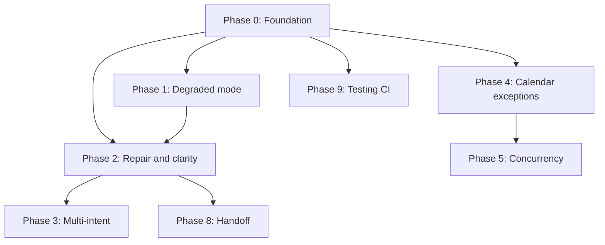

# Implementation roadmap — stability & conversation coverage

This document turns the gap analysis (stability, calendar truth, conversation repair, etc.) into a **phased plan** with dependencies and exit criteria. It is meant to be edited as work completes: use the checkboxes for tracking.

**Related docs:** [BACKEND_SYSTEM_OVERVIEW.md](./BACKEND_SYSTEM_OVERVIEW.md), [ASSISTANT_CAPABILITIES_REPORT.md](./ASSISTANT_CAPABILITIES_REPORT.md)

---

## Guiding principles

1. **Stability before net-new features** — Validation, timeouts, and observability reduce pain across all flows.
2. **Narrow “done”** — Each phase lists measurable exit criteria.
3. **Ship safely** — Use env flags or feature toggles when behavior changes could affect production.
4. **Scope honesty** — Multi-intent decomposition, recurring series, in-chat payments, and waitlists are **separate product tracks**, not one sprint.

---

## Phase 0 — Foundation (LLM safety & visibility)

**Target:** 2–4 weeks  
**Goal:** Safe LLM usage, structured validation, and enough telemetry to debug production.

| Status | Item | Notes |
| :----: | ---- | ----- |
| [x] | **LLM timeouts** | `src/services/llmClient.js` — `LLM_TIMEOUT_MS` (default 20s), `AbortController` on Groq + Ollama. |
| [x] | **Retries** | Same module — `LLM_MAX_RETRIES` (default 2); retries on 5xx, 429, network-ish errors only. |
| [x] | **Circuit breaker** | Consecutive **full** request failures trip open; `LLM_CIRCUIT_FAILURE_THRESHOLD`, `LLM_CIRCUIT_COOLDOWN_MS`; throws `LLMCircuitOpenError`. |
| [x] | **Structured validation (Zod)** | `src/validation/aiOutput.js` — sanitizes booking / classify / reschedule / availability outputs (dates vs `today`, `HH:MM`). |
| [x] | **Correlation ID** | `src/context/correlation.js` — `runWithCorrelation` wraps each `handleMessage` invocation (`randomUUID`). |
| [x] | **Minimal metrics** | `src/utils/metrics.js` — `inc()` for webhook, LLM calls/successes/failures/timeouts/circuit_blocks, booking success, slot_taken. |

**Exit criteria**

- [x] Core paths covered by unit tests (`__tests__/llmClient.test.js`, `__tests__/aiOutput.test.js`); full suite passes.
- [x] Past calendar dates from malformed LLM output are nulled before DB (see `normalizeDateOrNull`).

---

## Phase 1 — Degraded mode & outbound robustness

**Target:** 1–2 weeks  
**Depends on:** Phase 0 (timeouts + circuit breaker)  
**Goal:** When AI is unhealthy, booking can still proceed on rules + FSM + deterministic matchers.

| Status | Item | Notes |
| :----: | ---- | ----- |
| [x] | **Degraded flag** | `isLlmDegraded()` in `llmClient.js` — `LLM_DEGRADED=1|true|yes` **or** circuit open (`isLlmCircuitOpen()`). |
| [x] | **Degraded behavior** | `src/services/aiDegraded.js` — keyword `classifyMessageDegraded`, rule-based booking/reschedule/availability extraction; `extractConfirmation` → `unknown` without LLM; no LLM on conversational fallbacks. |
| [x] | **User-facing copy** | Help/help-reply/returning greetings include “simple mode”; metric `llm_degraded_handling`. |
| [x] | **Outbound** | Already: `sendWithRetry` in `whatsapp.service.js` (one retry on network/5xx). |

**Exit criteria**

- [x] Degraded path unit-tested (`__tests__/aiDegraded.test.js`); FSM + `serviceMatch` unchanged; full suite passes.

---

## Phase 2 — Conversation repair & clarity

**Target:** 3–5 weeks  
**Depends on:** Phase 0–1 recommended  
**Goal:** Handle real messy chats without requiring full multi-intent AI.

| Status | Item | Notes |
| :----: | ---- | ----- |
| [x] | **Explicit reset** | Keywords (`RESTART`, `START OVER`, `RESET`, `BEGIN AGAIN`, `START FRESH`, `NEW BOOKING`); `CONTINUE` re-prompt; cancel-flow guard when choosing which appointment. |
| [x] | **Step-level correction** | `stripCorrectionPrefix` + retries in `AWAITING_SERVICE` / `AWAITING_DATE` / `AWAITING_TIME`; mid-flow **date change** while in `AWAITING_TIME` when a new date is extracted. |
| [x] | **Ambiguity prompts** | Help copy lists reset keywords; date step uses clearer copy when a correction strip still yields no date; existing disambiguation for cancel/reschedule lists. |
| [x] | **`temp_data` hygiene** | [SESSION_TEMP_KEYS.md](./SESSION_TEMP_KEYS.md) documents keys per state; transitions clear `time` / `displaySlots` when dates change. |

**Exit criteria**

- [x] **Behavior + tests:** `__tests__/conversationRepair.test.js` covers correction stripping; `npm test` passes; `AWAITING_TIME` updates date/staff/slots when user names a different day mid-flow.
- [ ] Optional: dedicated **golden transcript** tests for full WhatsApp-style threads (can follow in Phase 3). *(Partial: `__tests__/webhook.handleMessage.awaitingTime.test.js` exercises `handleMessage` in `AWAITING_TIME` with mocks.)*

---

## Phase 3 — Multi-intent & compound requests

**Target:** 4–8 weeks  
**Depends on:** Phase 0 (validation) + Phase 2 (reset/correction)  
**Goal:** One message with multiple operations, executed safely.

| Status | Item | Notes |
| :----: | ---- | ----- |
| [ ] | **Decomposition schema** | LLM returns structured `{ operations: [...] }` with Zod validation. |
| [ ] | **Sequential execution** | Run operations in order; confirm before destructive steps (cancel). |
| [ ] | **Guardrails** | Cap operations per message (e.g. max 2); refuse hostile or ambiguous stacks. |

**Exit criteria**

- [ ] At least one golden transcript: “cancel X and book Y” with explicit confirmation between cancel and book.

**Risk:** High complexity — defer until Phases 0–2 are stable in production.

---

## Phase 4 — Calendar truth (exceptions & buffers)

**Target:** 3–6 weeks  
**Goal:** Slots match real closures and spacing.

| Status | Item | Notes |
| :----: | ---- | ----- |
| [x] | **Business-level exception days** | Table `business_calendar_exceptions` (`db/schema.sql`, `db/migrations/001_business_calendar_exceptions.sql`); `closed` or `open_start`/`open_end` merged in `getAvailableSlots`. |
| [ ] | **Staff-level exceptions (optional)** | Overrides per `staff_id` + `date`. |
| [ ] | **Buffer / turnaround** | `buffer_minutes` (business or service); reduce contiguous free time after bookings. |

**Exit criteria**

- [x] Unit tests: public holiday closed; partial day shortened hours (`__tests__/appointment.calendarExceptions.test.js`).
- [ ] Buffer / staff-level exceptions covered by tests when implemented.

---

## Phase 5 — Concurrency & slot races

**Target:** 1–2 weeks  
**Depends on:** Phase 4 if slot logic changes  
**Goal:** Fewer surprises when two users grab the same minute.

| Status | Item | Notes |
| :----: | ---- | ----- |
| [ ] | **Transactional booking** | “Check slot + insert” under appropriate isolation / locking. |
| [ ] | **Standardized `SLOT_TAKEN` UX** | Curated alternatives + single clear pattern (already partially present; make consistent). |

**Exit criteria**

- [ ] Concurrent integration test: one winner, one structured recovery path.

---

## Phase 6 — Product depth (parallel tracks, multi-quarter)

Pick by business priority. Each is a **mini-product**.

| Track | Status | Items |
| ----- | :----: | ----- |
| **Payments** | [ ] | Hold / confirm via payment link (e.g. Razorpay order); persist payment state on appointment. |
| **Waitlist** | [ ] | Queue when no slots; cron + template when something frees. |
| **Recurring** | [ ] | Series or repeat rule; either multiple rows or parent `series_id`. |
| **Attachments / intake** | [ ] | Secure links; avoid large payloads in LLM context. |

---

## Phase 7 — Safety & compliance (ongoing)

| Status | Item | Notes |
| :----: | ---- | ----- |
| [ ] | **Log & PII policy** | Document retention; redact phones in dev logs where possible. |
| [ ] | **Moderation (optional)** | Input/output filters for abuse; refuse unsafe advice outside booking. |
| [ ] | **Locale** | Preferred language per customer or one-time detection; pass into prompts. |

---

## Phase 8 — Human handoff (close the loop)

**Target:** 2–4 weeks  
**Depends on:** Phase 2 useful for “start over” vs handoff

| Status | Item | Notes |
| :----: | ---- | ----- |
| [ ] | **Owner notification** | Email or WhatsApp to business with summary + customer phone when user requests human. |
| [ ] | **Handoff queue (optional)** | `handoff_requests` with `open` / `claimed` / `closed`. |
| [ ] | **SLA copy** | Only promise response times you can meet. |

---

## Phase 9 — Testing & CI (start in Phase 0, never stop)

| Status | Item | Notes |
| :----: | ---- | ----- |
| [ ] | **Golden transcripts** | Full multi-turn fixtures TBD. **Partial:** `webhook.handleMessage.awaitingTime.test.js`, `conversationRepair.test.js`. |
| [x] | **Chaos tests** | `llmClient.test.js` — retries on 5xx, circuit opens, `LLMCircuitOpenError`; slot logic mocked in `appointment.calendarExceptions.test.js`. |
| [ ] | **Staging + Meta** | Periodic checks: templates, 24h window, media limits. |

---

## Dependency overview

---

## Suggested first release bundle

A pragmatic **v1 roadmap slice** that balances risk and user impact:

1. **Phases 0 + 1 + 2** (stability + conversation repair)  
2. **Phase 4** — at least business-level exception days  
3. **Phase 9** — minimal golden + chaos tests alongside 0–1  

Then: **Phase 5**, **Phase 8**, then consider **Phase 3** and **Phase 6** by business need.

---

## Document maintenance

- Update checkboxes and dates when phases complete.
- Add links to PRs or ADRs for major schema changes (exceptions table, handoff queue, etc.).

*Last updated: 2026-04-18*
